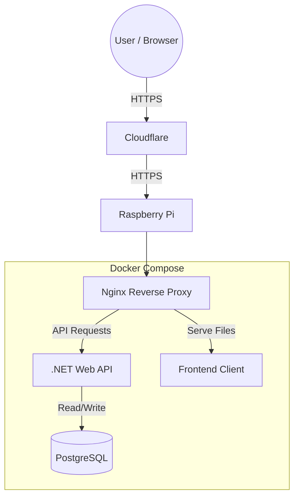

# Deployment

This document outlines the deployment architecture, CI/CD pipelines, and environment configurations for the PUTwiki system. 

## CI/CD pipeline
Our continuous integration and continuous deployment (CI/CD) pipeline is built using **GitHub Actions**. It automates our workflows to ensure code quality and reliable deployments:

* **CI ([config](../../.github/workflows/ci.yml)):** Triggered on each push in pull requests. Looks for changes in client and server. Then runs formatters, linters, builds both apps and runs all unit tests.
* **CodeQL ([config](../../.github/workflows/codeql.yml)):** On each push in pull requests runs automated static code analysis and security scanning to identify vulnerabilities before they are merged.
* **CD ([config](../../.github/workflows/cd.yml)):** Triggered manually by pull request author after merging changes to the main branch. It handles building the production Docker images, pushing them to container registry and updating app on our production server.

## Infrastructure & hosting (MVP)
For the MVP phase, the production environment is hosted on a **private Raspberry Pi**. 

* **Cloudflare:** Acts as our DNS provider and edge proxy, providing DDoS protection and caching for our public domain.
* **Raspberry Pi:** The physical server. It has an open port for HTTPS traffic coming from Cloudflare.
* **Docker Compose:** The entire infrastructure runs as a containerized stack on the Pi.

## Deployment architecture
We use a modular `docker-compose` setup with a [base configuration](../../compose.yml) and environment-specific overrides for [dev](../../compose.override.yml) and [prod](../../compose.prod.yml).

Here are core services we run in docker compose:
* **Nginx:** Acts as a reverse proxy, listening on port 80 (and 443 in production). It routes API traffic to the backend and serves the frontend client. 
* **Backend API:** The ASP.NET Core backend running Kestrel. 
* **Frontend:** The bundled client application.
* **PostgreSQL:** Our main database, utilizing named volumes for data persistence.

**NOTE:** we will gradually add more services to our compose file so we listed above only the most important ones. Look inside compose files to see other services.

## Deployment diagram

## Environments

### 1. Local development
* Developers run the database using Docker (`docker compose up database`), with Postgres mapped to port `5433` to avoid host conflicts.
* `pgAdmin` panel is available on port `5050` for local database management.
* The backend and frontend should run directly on the host machine (outside of Docker) to allow for hot-reloading, debugging, etc.

### 2. Docker preview
* The entire PUTwiki system can be spun up on developer's machine inside Docker using either the Development or Production compose overrides.
* **Note:** Because we do not use bind mounts for source code, this mode is used purely for previewing the built containers and testing system integration (e.g. Nginx config), not for writing code.

### 3. Production
* Hosted on the Raspberry Pi.
* Uses the production compose override.
* The stack relies on health checks to ensure services start in the correct order (e.g. frontend waits for backend which waits for database to be healthy).

## Secrets management
Secrets are strictly kept out of source control.

* **GitHub Actions:** CI/CD variables are stored securely in GitHub Secrets.
* **Docker Compose:** Secrets and configuration values are injected into the containers using local `.env` files.
* **Data Protection:** ASP.NET Core Data Protection keys are persisted across container restarts using a dedicated Docker volume (`aspnet_keys`) to ensure authentication cookies/tokens remain valid.