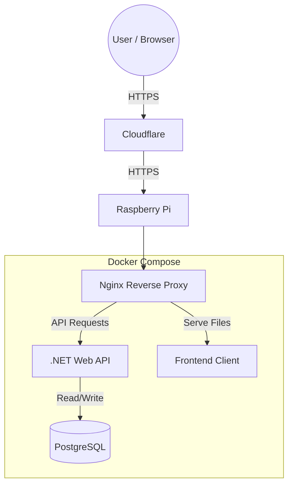
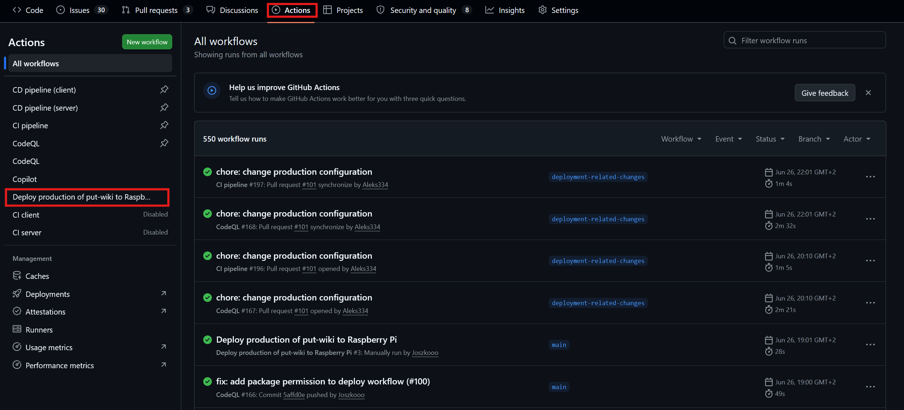
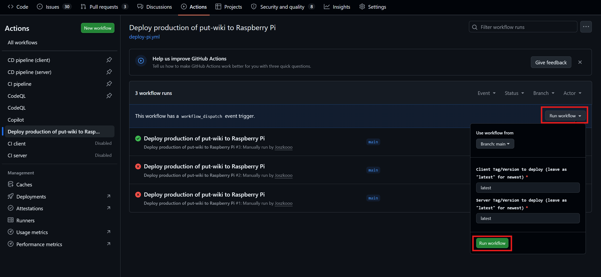
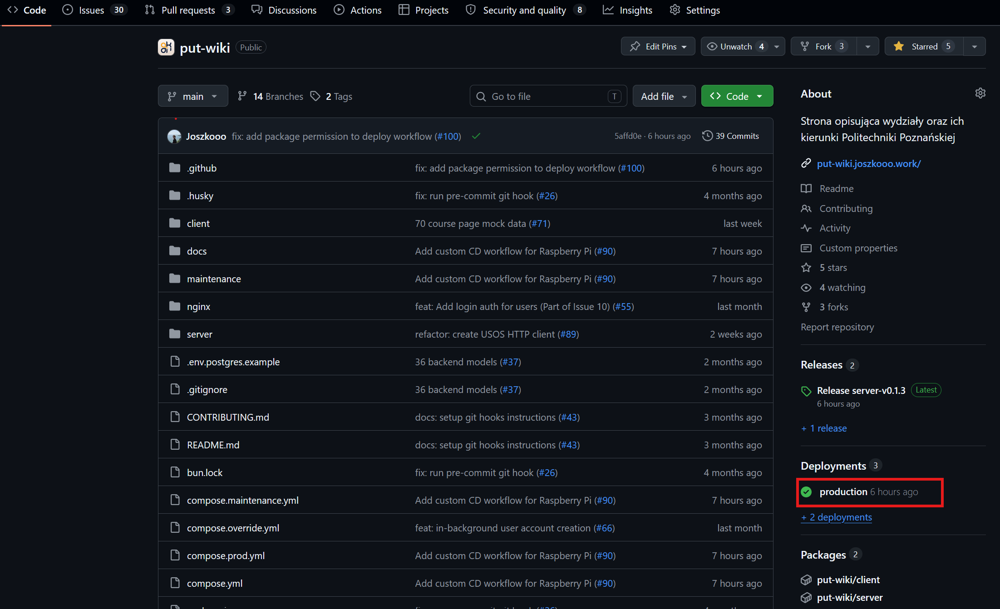

# Deployment

This document outlines the deployment architecture, CI/CD pipelines, and environment configurations for the PUTwiki system. 

## CI/CD pipeline
Our continuous integration and continuous delivery (CI/CD) pipeline are built using **GitHub Actions**. It automates our workflows to ensure code quality and reliable deployments:

* **CI ([config](../../.github/workflows/ci.yml)):** Triggered on each push in pull requests. Looks for changes in client and server. Then runs formatters, linters, builds both apps and runs all unit tests.
* **CodeQL ([config](../../.github/workflows/codeql.yml)):** On each push in pull requests runs automated static code analysis and security scanning to identify vulnerabilities before they are merged.
* **CD ([config](../../.github/workflows/cd-client.yml)):** Separate for client and server. Triggered automatically after merging changes to the main branch. It handles versioning, creating github releases and building the production Docker images that are pushed to container registry.
* **Deployment ([config](../../.github/workflows/deploy-pi.yml)):** Must be launched manually by feature author to deploy released changes to production enviroment. You can provide specific version or deploy the newest. Server and client are versioned separately, so you can deploy different version of client and server. This is especially useful if you want to rollback one, but leave current version of other app.

## Infrastructure and hosting
For the MVP phase, the production environment is hosted on a **private Raspberry Pi**. 

* **Cloudflare:** Acts as our DNS provider and edge proxy, providing DDoS protection and caching for our public domain.
* **Raspberry Pi:** The physical server. It has an open port for traffic coming from Cloudflare.
* **Docker Compose:** The entire infrastructure runs as a containerized stack on the Pi.

## Deployment architecture
We use a modular `docker-compose` setup with a [base configuration](../../compose.yml) and environment-specific overrides for [dev](../../compose.override.yml) and [prod](../../compose.prod.yml).

Here are core services we run in docker compose:
* **Nginx:** Acts as a reverse proxy, listening on specific port. It routes API traffic to the backend and serves the frontend client. 
* **Backend API:** The ASP.NET Core backend. 
* **Frontend:** The bundled client application.
* **PostgreSQL:** Our main database, utilizing named volumes for data persistence.

### Maintenance
For better UX we display maintenance page during deployment of new versions. This is handled in separate [compose file](../../compose.maintenance.yml). Config for maintenance page is [here](../../maintenance)

> [!NOTE]
> We will gradually add more services to our compose file so we listed above only the most important ones. Look inside compose files to see other services.

## Deployment diagram

## Environments

### 1. Local development
* Developers run the database using Docker (`docker compose up database`), with Postgres mapped to port `5433` to avoid host conflicts.
* `pgAdmin` panel is available on port `5050` for local database management.
* The backend and frontend should run directly on the host machine (outside of Docker) to allow for hot-reloading, debugging, etc.

### 2. Docker preview
* The entire PUTwiki system can be spun up on developer's machine inside Docker using either the Development (with `docker compose up`) or Production (with `docker compose -f compose.yml -f compose.prod.yml up`) compose overrides.

> [!NOTE]
> Because we do not use bind mounts for source code, this mode is used purely for previewing the built containers and testing system integration (e.g. Nginx config), not for writing code.

### 3. Production
* Hosted on the Raspberry Pi.
* Uses the production compose override.
* The stack relies on health checks to ensure services start in the correct order (e.g. frontend waits for backend which waits for database to be healthy).

## How to deploy released changes to production?

Once your changes has been merged to main, then continous delivery pipeline should create client, server or both docker images with bumped versions depending on what changes you made. When workflow completes, you can deploy your feature to production enviroment. To do that follow the steps below:
1. Go to `Actions` tab in repo and select workflow that deploys to prod

2. Next click gray `Run workflow` button. Popup with two inputs for entering client and server versions will show up. Usually you won't need to enter anything to bump version on prod. This is only for rollbacks. Simply press green `Run workflow` button to start deployment.

3. If you see that everything is green, then deployment is successful. You can see all deployments in `Deployments` section on `Code` tab. Now you can make sure that your changes also work on production.

> [!IMPORTANT]
> If you changed nothing related to `client/` or `server/`, but it still affects production, such as docker compose or proxy configuration, then you should deploy your changes right after merge to main. CD pipeline won't create any docker images, as they are only created when updating client and/or server.

> [!NOTE]
> Changes made only to project documentation shouldn't be deployed separately, because they don't impact production enviroment. They will be included in releases with production related code

## Secrets management
Secrets are strictly kept out of source control.

* **Docker Compose:** App secrets are injected into the containers using local `.env` files.
* **Data Protection:** ASP.NET Core Data Protection keys are persisted across container restarts using a dedicated Docker volume (`aspnet_keys`) to ensure authentication cookies/tokens remain valid.